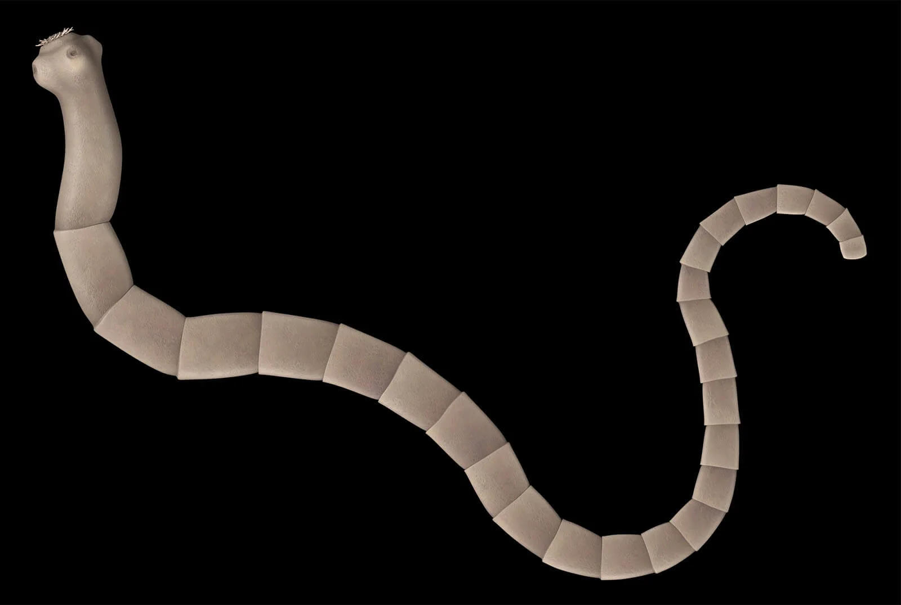

## Diese 3 Parasiten können das menschliche Gehirn befallen

Neuroparasiten befallen das Nervensystem ihres Wirtes und können sogar sein Verhalten manipulieren. Vor allem im Tierreich gibt es dafür Beispiele. Auch wenn ein Befall beim Menschen eher selten ist: Diese drei Parasiten können in das menschliche Gehirn eindringen

### 1. Toxoplasma gondii: Könnte Verhaltensveränderungen verursachen

Toxoplasma gondii ist ein einzelliges Urtierchen, das Mäuse und Ratten befällt und sie ihre Angst vor Katzen verlieren lässt. Andere Angstreflexe bleiben erhalten. So kann die Katze die Maus fressen. Über Katzen wiederum kann der Parasit auf den Menschen übertragen werden. Rund ein Drittel der Weltbevölkerung ist mit dem Erreger infiziert, der sich in Zysten im Gehirn verstecken kann.
Bei Ratten und Mäusen hat man nachgewiesen, dass der Neuroparasit den Hormonhaushalt beeinflusst. Ein Forscher der Karls-Universität in Prag nimmt zudem an, dass infizierte Personen ein verändertes Sexual- und Risikoverhalten haben:
- Betroffene verknüpfen Angst und (sexuelle) Erregung enger und neigen zu Praktiken aus dem BDSM-Spektrum.
- Frauen begehen häufiger Selbstmord.
- Männer werden aggressiver, suchen eher das Risiko und haben einen gesteigerten Sexualtrieb.

### 2. Bandwürmer: Können auch das Gehirn befallen

Ein Bandwurm kann über das Blut in alle Organe vordringen und dort bis zu 20 Jahre ausharren. Meist nisten sich die Würmer im Darm ein, aber auch das Gehirn ist vor einem Befall bestimmter Arten nicht sicher: In China etwa entfernte man einem Mann einen zehn Zentimeter langen Bandwurm aus dem Gehirn. Das Tier lebte noch. Der Träger war wegen epileptischer Anfälle ins Krankenhaus eingeliefert worden. Nach der Operation geht es ihm wieder gut. 

### 3. Naegleria fowleri: Gehirnzerfressende Amöbe

Parasiten beim Menschen, das sind meist Würmer, Läuse und Co. Aber Amöben? Danach sucht kaum ein Arzt, denn eine Infektion damit ist extrem selten. Aber genau das macht die Einzeller so gefährlich.
Naegleria fowleri zum Beispiel gedeiht in sehr warmen Gewässern und gelangt durch die Nase über den Riechnerv ins Gehirn. Dort löst sie eine Gehirnentzündung aus – eine sogenannte Amöbenenzephalitis –, die mit Symptomen wie Kopfweh, steifem Nacken und Orientierungslosigkeit einhergeht. Womöglich fällt der Patient ins Koma und verstirbt nach ein bis zwei Wochen. Mittlerweile gibt es erste erfolgreiche Methoden zur medikamentösen Behandlung der Amöbeninfektion – wenn sie denn rechtzeitig erkannt wird.

